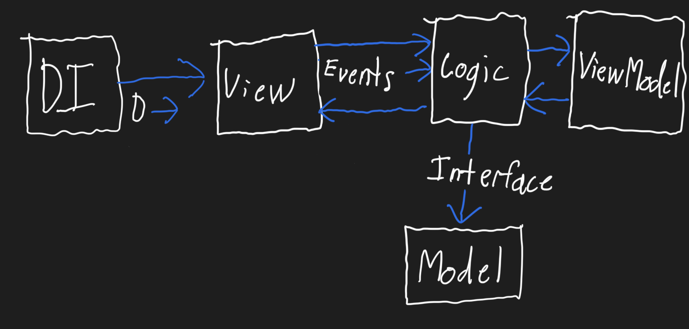

# Burger Ordering App

This project is mirrored on my [BitBucket account.](https://bitbucket.org/davidprecopia/burgerorderingapp/src/master/)

# Architecture

### DI (Dependency Injection)
* This creates the various dependencies of a class (the View, Logic, and ViewModel) and injections them.
* Injection simple means the dependencies are being passed to the class, as oppose to the class itself creating them.
* The "D →" indicating the dependencies being passed into the View.
### View
* This displays the GUI to the user.
* I keep it as dumb as possible, instead keeping all of the complex logic in the Logic class. This is due to GUIs requiring more overhead to test (as all who've used Cucumber know well) - takes longer, more resources, etc - as oppose to unit test run on the JVM.
### Logic
* As the name suggests, this is were all of the logic is kept, the brains of the view.
* Due to it not being tied to a GUI, you can write unit tests for the complex code you're written to drive the View. They run on the JVM so they are quick and cheap (500 unit tests could finish in 10 seconds).
* This is the class that interacts with the backend (database, outer API, etc.).
### ViewModel
* This stores data for the View, Strings, Lists of Burgers, etc., etc.
* It is separate from Logic due to,
    1. Brains of the View and storage for the View are two different things, thus should be separate.
    2. Localization.
* Regarding localization, all of the user facing text is stored somewhere separate from these classes. That ensures the correct text/String is returned depending upon the device's selected language.
### Model (the backend model)
* Where data is stored and/or retrieved. i.e., local database, calls to the outer, calls to remote storage.
* Its separation from the front end is enforced via an Interface - think of it as a contract.

### Interfaces
* Think of an Interface as a contract - like one you'd have with a contractor. It doesn't exactly whom installs your water heater, as long as the contract you signed is fulfilled.
* This promotes encapsulation. It forces you to think of each part a thinly connected to each - avoid them from relying upon each other. For example, hiding our database implementation behind an Interface ensures that both the front and back ends remain as separated as possible - promoting encapsulation.
* Benefits:
    * The more decoupled your classes are, the easier they are to unit test and are less bug-prone overall. I know, pretty broad statements - I could write an entire article explaining why.
    * If you wanted to swap out a local database with a remote one (for example), then we wouldn't need to touch a single line of the front end - encapsulation FTW.

### Events
* Encourages and enforces Separation of Concern + allows you to only expose a single method to the View.
    * Instead of each classes "talking" to each other by directly calling each-others' methods, instead, a single method is exposed (e.g., `onEvent()`) and all Event are passed to it.
    * Although this means more overhead for setting up these classes, it pays off in the long run - it's scalable. Now, we only have like 3 methods a piece for the Logic and View classes, it's easy to manage. However, as features, and thus complexity, increase - it will become a massive pain-in-the-butt to manage (and debug) the every increasing number of methods. E.g., in one of my personal projects, one View has 10 ViewEvents (View -> Logic) and 12 LogicEvents (Logic -> View).
* Events + Interfaces = Encapsulation. The more encapsulation you have between the different parts, the less bug prone they will be and easier to write unit tests for.
* Extras:
    * Stand alone example, [ViewEventsJavaExample](https://bitbucket.org/davidprecopia/vieweventsjavaexample/src/master/).
    * An excellent jargon-free article, [Simplify Your UI Interactions With Events | Java, Kotlin, Any Language](https://medium.com/swlh/simplify-your-ui-interactions-with-events-java-kotlin-any-language-5062c1b1e0e4).

## Further Reading
Recommend reading to further dive into these topics. They are light hearted with non-jargon explanations.
* [The Problem Domain](https://rkay301.medium.com/programming-fundamentals-part-two-the-problem-domain-how-to-design-a-program-application-4faf0a5753f8)
* [Separation of Concerns](https://rkay301.medium.com/programming-fundamentals-part-5-separation-of-concerns-software-architecture-f04a900a7c50)

## Advance Implementation of the above architecture (some quick and dirty notes)
* The View subscribes to Logic and ViewModel.
    * This ensures that neither of those hold a reference to the View. If the View is destroyed, and either Logic and/or ViewModel have a reference to it, then a memory leak will occur.
* Logic's init() method returns a subscribable - e.g., `logic.init().subscribe()`
* Each part is separated by an Interface, a contract. Ensuring they are separated even more, as well as, increasing their testability.

---

# Some tips and tricks from each lesson

### State and Bugs
* Had a bug of a ViewModel returning null to the View, even thought the Logic class was setting it prior to that call.
    * My initial teachings had the View holding a reference to the ViewModel. This was to keep the example simple and avoid getting into Events, Interfaces, etc.
* The root cause was not properly managing state in the DependencyInjection class. Each invocation of the appropriate method returned a new instance of the ViewModel. This was solved by having the method that creates the ViewModel in the DependencyInjection class, return a Singleton.
* Take away: State is evil (to keep it simple). Something you'll learn with time. Pro tip, learn functional programming + how to mix it with OOP.

### Singletons
* As the name suggests, it's when you enforce that a single instance of a class is created.
* Assists in avoiding state. Should be used judiciously.
* An example can be found [here](https://bitbucket.org/davidprecopia/burgerorderingapp/src/60c814e696817f90029c9fe44eed575ce0a26d92/src/main/java/common/DependencyInjection.java#lines-16).

### Initializing fields within the Constructor
* When the Constructor is called with the `new` keyword (e.g., `new ViewModel()`), all of the code within that Constructor is executed before the Constructor returns. Once the Constructor returns, you have a new instance of that class to work with.
* When you initialize your fields within the Constructor, you ensure that they are ready-to-go before any method can be called against the newly created instance.
* When you initialize your fields outside of the Constructor (e.g., `private List<String> list = new ArrayList<>()`), then you cannot guarantee that that field will be initialized whenever it is called. That is due to the simple fact there is no guarantee whatsoever to when they will be initialized, when those exact lines of code will be run.
* Take away: always initialize your fields from within the Constructor to ensure they are, in fact, fully initialized.